<h1 align="center">Hey  I'm Rochus</h1>

  

## 🧠 My Focus Areas
- Game Engine
- Graphics Engineering
- AI Agents

## 📊 GitHub Stats & Trophies

  
  

<!-- 

  

 -->

  

<!-- 

  

 -->

## 🛠️ Languages & Tools

  

  

